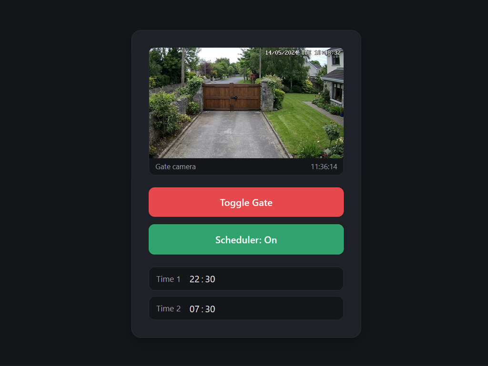
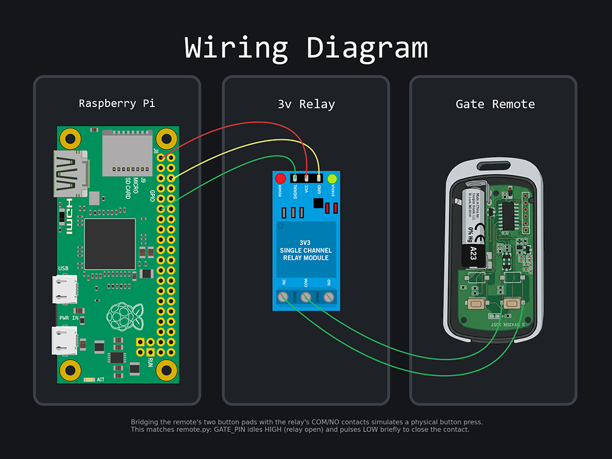

# Gate Remote

Flask web app that triggers a Raspberry Pi GPIO relay to toggle a physical gate remote, with a daily on/off schedule and an optional ntfy push notification on each toggle.



## Features

- One-click toggle over a relay wired to a GPIO pin
- Two configurable daily schedule times, with a scheduler on/off switch (off by default)
- Optional live-ish gate camera panel — pulls a still frame from an RTSP feed every 10s
- Optional push notification via [ntfy](https://ntfy.sh) on each toggle
- Runs as a systemd service, starts on boot, restarts on failure
- Installer optionally sets up `ufw`: SSH restricted to your LAN, HTTP restricted to a single IP (e.g. a reverse proxy)

## Wiring



The relay bridges the remote's two button PCB pads — closing that contact simulates a physical button press. `GATE_PIN` idles HIGH (relay open) and pulses LOW briefly to trigger it, matching an active-LOW relay module.

## Requirements

- Raspberry Pi (or any Linux host with GPIO) running Raspberry Pi OS / Debian / Ubuntu
- Python 3.9+
- A relay wired to the configured GPIO pin (default: BCM 17)

## Install

```bash
git clone <this-repo>
cd gateremote
./install.sh
```

This will:

1. Create a Python venv and install dependencies
2. Copy `.env.example` to `.env` (edit it with your ntfy details)
3. Add your user to the `gpio` group
4. Install and enable a `gateremote` systemd service on port `4000`
5. Optionally install/configure `ufw` — prompts for your LAN subnet (SSH) and a single IP allowed to reach port 4000 (e.g. your reverse proxy)

Skip the firewall step with:

```bash
./install.sh --skip-firewall
```

## Configuration

Set in `.env` (see `.env.example`):

| Variable | Description |
|---|---|
| `GATE_WEBHOOK_URL` | ntfy topic URL to POST to on toggle (optional — leave blank to disable) |
| `GATE_WEBHOOK_TAG` | Value for the `ta` header sent with the notification |
| `GATE_PIN` | BCM pin number wired to the relay (default `17`) |
| `GATE_HOLD_SECONDS` | How long to hold the pin low to simulate a button press (default `1.5`) |
| `RTSP_URL` | `rtsp://username:password@<ip>/stream` — leave blank to hide the camera panel |
| `SNAPSHOT_INTERVAL` | Seconds between camera refreshes (default `10`) |

Camera snapshots are captured with `ffmpeg` (installed automatically by `install.sh`), so no extra Python image libraries are needed.

## Usage

- Visit `http://<pi-address>:4000/`
- **Toggle Gate** — fires the relay once
- **Scheduler: On/Off** — enables/disables the two scheduled times below it; off by default and resets to off on every restart
- Edit either time field to reschedule that slot immediately

## Service management

```bash
sudo systemctl status gateremote
sudo systemctl restart gateremote
journalctl -u gateremote -f
```

## License

MIT
